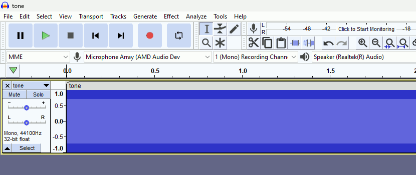

# C89 WAV Library

WAV file management library written in ASNI C, suitable for use with resource-limited microcontrollers.



## How to Include

Use the following snippets to include the library to your existing project.

### CMake Project

```cmake
add_subdirectory("/path/to/library" "c89-wav")

include_directories(${C89_WAV_DIR})

target_link_libraries({your-project} PRIVATE c89-wav)
```

### Make Project

```make
make install

gcc {your/source/files} -l:c89-wav.a
```

## Examples

Following examples should get you started, refer to the additional ones in the [examples](./examples) directory.

### Opening & Closing

```c
WAV_FILE file = wav_open("/path/to/file.wav", WAV_READ);

if (wav_is_open(&file)) {
    
    // Do Stuff
    
    if (!wav_close(&file)) {
        // Handle I/O Error
    }
}
```

### WAV Header

```c
WAV_FILE file = wav_open("/path/to/file.wav", WAV_READ);

if (wav_is_open(&file)) {
    
    uint32_t chunk_id        = wav_get_ChunkID(&file);
    uint32_t chunk_size      = wav_get_ChunkSize(&file);
    uint32_t format          = wav_get_Format(&file);
    uint32_t subchunk1_id    = wav_get_Subchunk1ID(&file);
    uint32_t subchunk1_size  = wav_get_Subchunk1Size(&file);
    uint16_t audio_format    = wav_get_AudioFormat(&file);
    uint16_t num_channels    = wav_get_NumChannels(&file);
    uint32_t sample_rate     = wav_get_SampleRate(&file);
    uint32_t byte_rate       = wav_get_ByteRate(&file);
    uint16_t block_align     = wav_get_BlockAlign(&file);
    uint16_t bits_per_sample = wav_get_BitsPerSample(&file);
    uint32_t subchunk2_id    = wav_get_Subchunk2ID(&file);
    uint32_t subchunk2_size  = wav_get_Subchunk2Size(&file);
    
    if (!wav_close(&file)) {
        // Handle I/O Error
    }
}
```

### Reading Samples

```c
WAV_FILE file = wav_open("/path/to/file.wav", WAV_READ);

WAV_PCM16 sample;

if (wav_is_open(&file)) {
    
    wav_get_sample(&file, 2, &sample, NULL); // Fetch N-th Sample (0-Indexed)
    // wav_get_1ch_sample(&file, 2, &sample);
    
    while (wav_has_next(&file)) { // Loop Through Samples
        
        wav_next_sample(&file, &sample, NULL);
        
        // ...
    }
    
    wav_rewind(&file); // Rewind To Loop Again
    
    if (!wav_close(&file)) {
        // Handle I/O Error
    }
}
```

### Writing Samples

```c
WAV_FILE file = wav_open("/path/to/file.wav", WAV_NEW);

if (wav_is_open(&file)) {
    
    uint32_t i;
    
    uint8_t  duration       = 2;
    uint32_t sample_rate    = 44100;
    uint32_t total_samples  = duration * sample_rate;
    uint16_t tone_frequency = 1000;
    uint16_t tone_spp       = (sample_rate / tone_frequency) / 2;
    bool     tone_hstate    = false;
    
    WAV_PCM16  tone_high = WAV_PCM16_MAX;
    WAV_PCM16  tone_low  = WAV_PCM16_MIN;
    WAV_PCM16* tone_val  = &tone_low;
    
    if (wav_is_open(&file)) {
        
        wav_set_defaults(&file, 1);
        
        for (i = 0; i < total_samples; i++) {
            
            wav_push_sample(&file, tone_val, NULL);
            
            if ((i % tone_spp) == 0) {
                
                if (tone_hstate) {
                    tone_val = &tone_low;
                } else {
                    tone_val = &tone_high;
                }
                
                tone_hstate = !tone_hstate;
            }
        }
        
        if (!wav_close(&file)) {
            // Handle I/O Error
        }
    }
}
```

## Versioning Scheme

I use a 3-digit [Semantic Versioning](https://semver.org/spec/v2.0.0.html) identifier, for example 1.0.2. These digits have the following meaning:

*   The first digit (1) specifies the MAJOR version number.
*   The second digit (0) specifies the MINOR version number.
*   The third digit (2) specifies the PATCH version number.

## Copyright & License

Copyright (C) 2023 Đorđe Jocić

Licensed under the MIT license.
